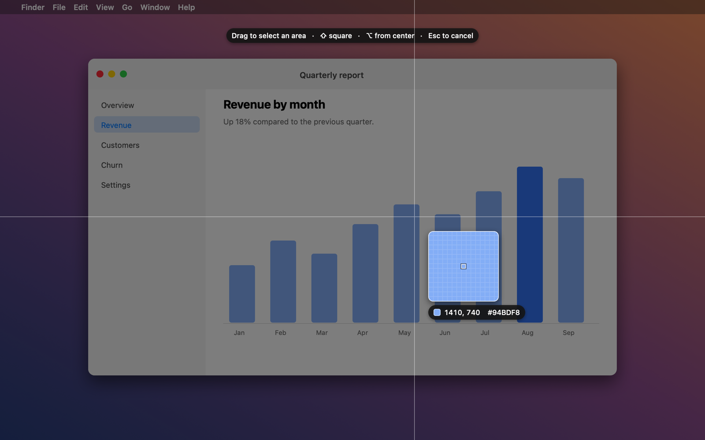
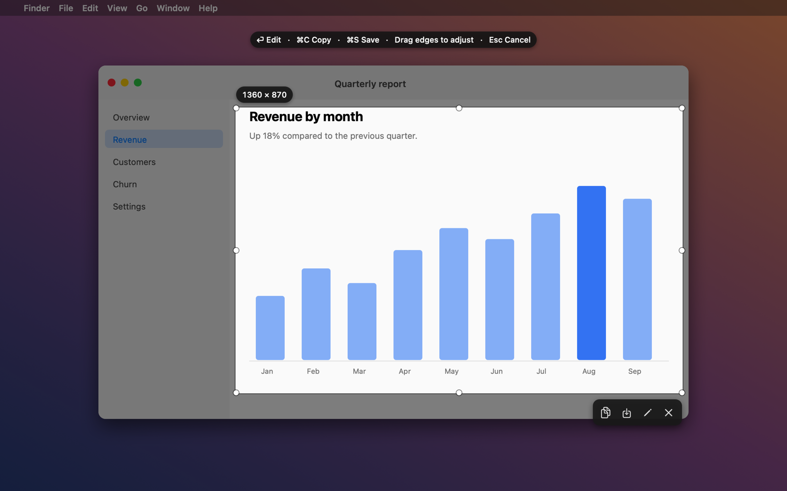
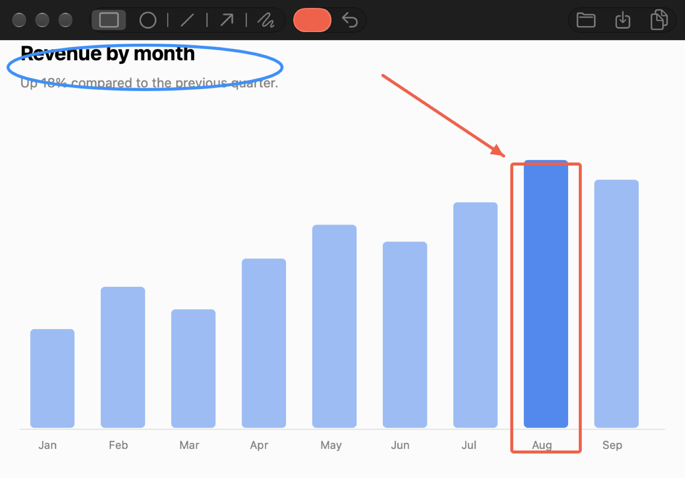

# Snip

**Free, native Lightshot alternative for macOS.**

A small menu bar app for taking area screenshots, marking them up, and copying or saving them. No accounts, no uploads, no subscription. Plain Swift on AppKit and ScreenCaptureKit, no third-party dependencies.



## Features

**Capture**

- `⌃⌘X` freezes the screen and lets you drag out an area. `⌃⌘A` grabs the whole screen under the cursor.
- Crosshair guides and a zoom loupe with a pixel grid, cursor coordinates, and the color under the cursor.
- The selection stays on screen after you release. Drag the handles to resize, drag inside to move, nudge with the arrow keys (`⇧` for 10 px).
- Hold `⇧` while dragging for a square, `⌥` to draw from the center.
- Action bar under the selection: copy, save, edit, cancel. Or `⌘C` to copy, `⌘S` to save, `⏎` to edit, `Esc` to cancel.



**Annotate**

- Rectangle, ellipse, line, arrow, and pen, with a color picker.
- Drag any shape by its outline to move it. `⌘Z` undoes.
- `⏎` copies the result to the clipboard. `⌘S` saves a PNG to `~/Pictures/Snips` and copies it.



**Menu bar**

- Open the Snips folder, or clear it. Cleared files go to the Trash after a confirmation.

## Install

Requires macOS 14 or later and the Xcode command line tools.

```sh
git clone git@github.com:sharryy/snip.git
cd snip
./build.sh --install
```

This compiles a release build, wraps it in `Snip.app`, signs it, copies it to `/Applications`, and launches it. Look for the scissors icon in the menu bar.

The first capture triggers the macOS Screen Recording permission prompt. Allow it, then quit and reopen Snip. macOS applies the permission on the next launch.

To start Snip at login: System Settings → General → Login Items → add `/Applications/Snip.app`.

### Signing

`build.sh` signs with a certificate named `Snip Dev` if one exists in your keychain, otherwise ad-hoc. A stable certificate matters: macOS ties the Screen Recording permission to the app's signature, and an ad-hoc signature changes on every build, so the permission would be silently dropped after each rebuild. To create one:

```sh
openssl req -x509 -newkey rsa:2048 -nodes -days 3650 -keyout key.pem -out cert.pem \
  -subj "/CN=Snip Dev" -addext "extendedKeyUsage=critical,codeSigning" -addext "keyUsage=critical,digitalSignature"
openssl pkcs12 -export -inkey key.pem -in cert.pem -out snipdev.p12 -passout pass:snip -name "Snip Dev" -legacy
security import snipdev.p12 -k ~/Library/Keychains/login.keychain-db -P snip -T /usr/bin/codesign
rm key.pem cert.pem snipdev.p12
```

## Change the hotkeys

Edit `areaHotKey` and `screenHotKey` at the top of `Sources/Snip/main.swift`, then rebuild. If another app already owns a combo, Snip tells you at launch.

## Layout

| File | What it does |
|---|---|
| `Sources/Snip/main.swift` | App delegate, menu bar item, global hotkeys, permission handling |
| `Sources/Snip/Capture.swift` | Grabs every display with ScreenCaptureKit |
| `Sources/Snip/Overlay.swift` | The selection screen: dim, guides, loupe, handles, action bar |
| `Sources/Snip/Editor.swift` | Annotation window and toolbar |
| `Sources/Snip/Export.swift` | Clipboard and PNG output |
| `build.sh` | Builds and bundles `Snip.app` |

## Why

Lightshot's macOS support is ending and most of the alternatives are paid. This is the small subset of Lightshot I actually used, in about 900 lines of Swift, easy to read and change.

## License

MIT
